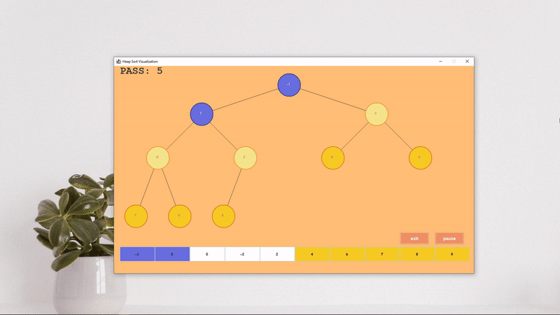

# Heap Sort Visualizer  
#### Data Structure and Algorithm Analysis Project  

This application simulates the **Heap Sort algorithm** using the Java programming language. It was created as part of a **college project** to practice and deepen understanding of sorting algorithms and their visualization.  

## Highlights of the Project  

- **First UI/Animation Application**  
  This was my first attempt at building an application with a user interface and animations, making it a significant milestone in my learning journey.  

- **Built Using Java Swing**  
  The user interface and animations were developed using **Java Swing**, a robust framework for building desktop applications in Java.  

- **Interactive Algorithm Simulation**  
  The application visually demonstrates the Heap Sort algorithm in action, showcasing step-by-step operations, such as heap construction and the sorting process.  

  

This project allowed me to combine programming, algorithm analysis, and UI development, paving the way for more complex application designs in the future.
